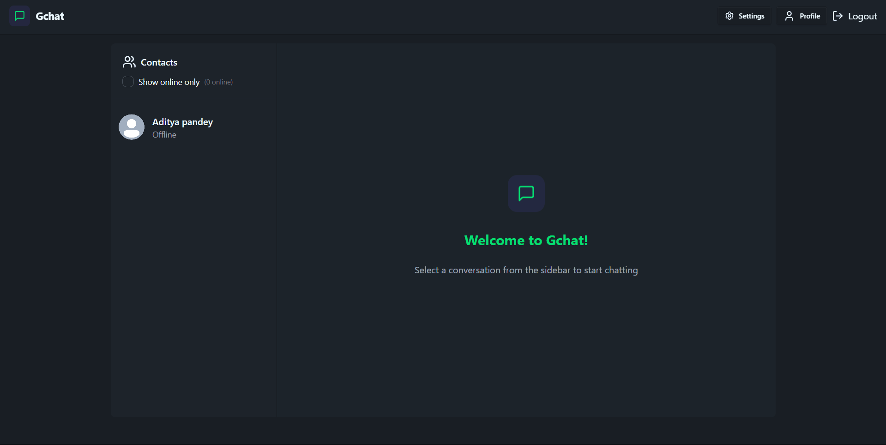

# GChat 🗨️

GChat is a **real-time group chatting application** built with **Socket.IO** for seamless WebSocket communication. It is a **full-stack application** designed to provide an interactive and fast messaging experience.

## 🚀 Features
- **Real-time messaging** powered by WebSockets (Socket.IO)
- **User authentication** for secure access
- **Responsive UI** for smooth user experience
- **Efficient backend** using Node.js and Express
- **Database storage** with MongoDB

## 🌐 Technologies Used
- **Frontend:** React.js, Daisy UI, Tailwind CSS
- **Backend:** Node.js, Express.js
- **Database:** MongoDB
- **WebSockets:** Socket.IO
- **Authentication:** JWT (JSON Web Token)

## 📸 Screenshot


## ⚡ Installation
Follow these steps to set up GChat locally.

```sh
git clone https://github.com/your-username/GChat.git
cd GChat
npm run build
npm run dev
